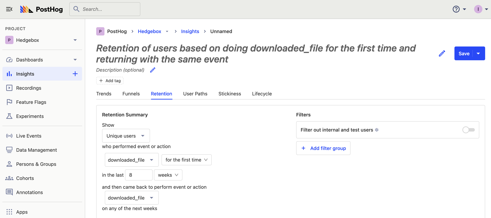
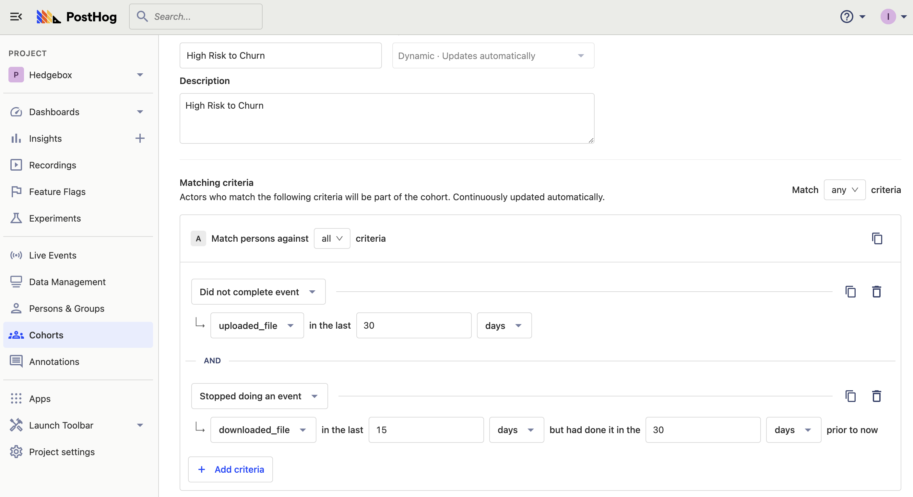
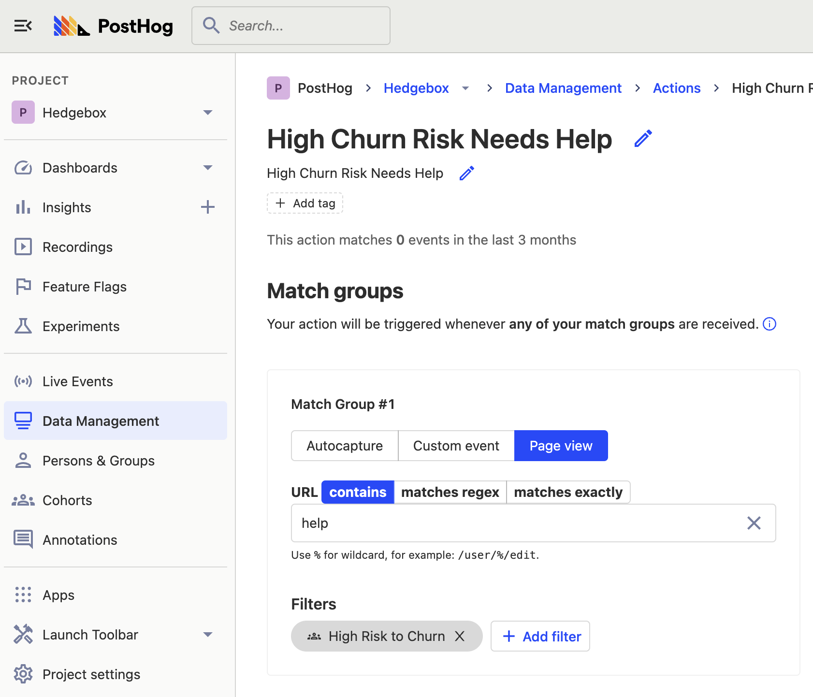

- **Level:** Easy 🦔
- **Estimated reading time:** 6 minutes ☕️

The word churn once reminded people of fresh butter, now it brings thoughts of lost users and revenue.

The churn rate is the percentage of users who stop an action during a certain period. It is used to understand the negative changes in usage, revenue, or other growth metrics. Understanding churn rate is key to figuring out problem areas in your product. 

In this tutorial, we will calculate and visualize the churn rate then use PostHog’s features of session recordings, cohorts, and actions to lower it.

## Step 1: Calculating churn rate

To calculate churn rate, first, you must define what ended or stopped. For subscription-based businesses, this could be monthly recurring revenue attributable to a subscriber. For a customer success or sales team, it could be organization usage. For a product team, it might be product usage events by a user. We will focus on product usage for this tutorial.

To calculate product usage churn, we need a group of users, events from usage they are triggering, and a time period. We can look back (however long your time period is) to check the total number of users triggering events and compare it to the number triggering events now. Our churn rate is the number of users who stopped divided by the total number of users at the beginning of the period.

> If we had 100 users who used triggered events for a feature at the beginning of the period, and 80 who were continuing to trigger events it at the end, we’d have a churn rate of 20% because (100 - 80) / 100 * 100 = 20%

Better yet, we can visualize and refine this calculation. PostHog has tools, like retention and lifecycle charts, that help you understand churn rate and see its changes over time.

## Step 2: Visualizing churn rate

To start visualizing churn rate, you can set up a retention funnel for users completing an action or event, then see how many continue their usage. The action or event you choose could be something like an autocapture of a pageview, an event capture you’ve written into your code or a combination of events (an action) that define feature usage. For us, we’ll set up a retention chart for unique users who completed the event `downloaded_file` over the last 8 weeks. 

We can calculate our weekly churn and total churn by comparing our initial cohort size with the percentage of users remaining. For example, if we care about weekly churn, we can compare Week 0 and Week 1. If we care about churn across the entire period, we can compare Week 0 and Week 8. To learn more about retention charts, check out our [product manual](/manual/retention).

### Lifecycle charts

Another way to visualize churn is through lifecycle charts. Lifecycle charts show us, in a time period, how many users:

- do an event for the first time
- returned to do that event
- didn’t do the event
- resurrect to do the event after not doing it in the previous period

The dormant users are the ones who churned. Comparing them with the ones who did the event (new, returning, or resurrected) can give you the churn rate for that event or action.

Once set up, we can click on the dormant part of the chart to get a list of dormant (churned) users. We can see their properties, save them as a cohort (which will be useful later), and watch their session recordings. This helps us gain insights to lower churn in the next section.

You can learn more about lifecycle charts in our [product manual](/manual/lifecycle). 

## Step 3: Lowering churn

Now that we calculated and visualized the churn rate in our product, we can figure out ways to lower it. Being an all-in-one product OS, PostHog has tools to help you with this, and they connect to your data and the work you’ve already done.

### Session recordings

The first tool is session recordings. From any of the visualizations, we can get a list of users who churned at specific times. Clicking on the charts we created earlier in this tutorial gives us a list of users. We can check this list for recordings of recent sessions of churned users.

Once we find a session recording from a churned user, we can watch their actions leading up to them churning. We might discover, for example, that the pricing page confuses users or that they can’t set up a key feature. We can use this information to improve these problem areas (check out [experiments](/manual/experimentation)).

### Cohorts

On top of making improvements to problem areas, we can monitor users at high risk to churn. To do this, we can set up a cohort in one of two ways.

The first is creating the cohort from the list of users in our chart. As mentioned earlier, clicking on the dormant part of the chart gives us a list of users who churned during this period. Clicking "Save as cohort" in the bottom right corner will turn them into a cohort we can monitor and analyze.

The second way to create a cohort is by going to the cohort page and filtering to match the high churn risk users. In our example, the filters are not completing a key event (uploading a file) in the last 30 days and stopping downloading files in the last 15 days (but having done so before).

Once saved, this provides us with a dynamic list of “high churn risk” users which we can monitor and use in other areas of PostHog.

### Actions

One way we can use a cohort is by combining it with an event to create an action. For example, we can set up an action to trigger when a user in our high churn risk cohort visits a help page. Using [webhooks](/docs/integrate/webhooks/message-formatting), we can bring these actions into [Slack](/docs/integrate/webhooks/slack) or wherever our sales or customer success team spends their time to have them reach out to users when the risk action is triggered.

Now we’ve targeted churn on multiple fronts, both by understanding what users are doing before they churn with session recordings and by monitoring users with cohorts and actions. We’ve begun to set up the tools for lowering churn. With continued improvement and experimentation, you’ll hopefully see improvements in your churn rate and the visualizations you’ve set up.

## Further reading

- [How to build, analyze and optimize conversion funnels in PostHog](/tutorials/funnels)
- [The most useful B2B SaaS product metrics](/blog/b2b-saas-product-metrics)
- [Finding your North Star metric and why it matters](/blog/north-star-metrics)

<NewsletterTutorial compact/>
